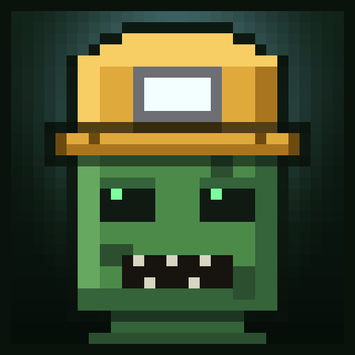

# SmartMobs

Zombies that plan a route, mine through walls, pillar, bridge, parkour and hunt in packs, seven lesser breeds
that make an ordinary night interesting — plus three items to fight back with. Minecraft **1.21.11**,
**1.21.1** and **1.20.1** on every current loader, and **26.2** on Fabric, Quilt and NeoForge, all from
one shared design.

Since 2.6 no zombie spawns plain: **20%** are miners, **10%** garden zombies and the remaining **70%** roll
one of the seven breeds, each wearing its own headgear so you can read what is coming at you. Difficulty is
tuned to be survivable and every number is config: miners carry a plain pickaxe instead of an Efficiency V
one, notice you at 32 blocks instead of 128 and no longer break nether portals unless you turn that back on.
They still ignore daylight - they are wearing helmets - and there is still no block they cannot eventually
mine.



The player-facing description (the text used for the Modrinth page) lives in [MODRINTH.md](MODRINTH.md).

## Repository layout

| Folder | Loader | Build system |
| --- | --- | --- |
| `fabric/` | Fabric Loader 0.19.3 + Fabric API 0.141.5 | Fabric Loom 1.17 |
| `quilt/` | Quilt Loader 0.30.0 (compiles the Fabric sources) | Quilt Loom 1.15 |
| `neoforge/` | NeoForge 21.11.44 | ModDevGradle 2.0 |
| `forge/` | MinecraftForge 61.1.0 | ForgeGradle 6 |
| `1.21.1/` | the same three loaders, one Minecraft version back | see below |
| `1.20.1/` | Fabric and Forge for the oldest supported version | see below |
| `26.2/` | the next Minecraft line (Forge still blocked upstream) | see below |
| `branding/` | mod icon (512 and 128 px) | — |
| `dist/` | jars renamed per loader, ready to upload (git-ignored) | — |
| `run/` | the old Forge dev game directory, left untouched | — |

Each folder is a standalone Gradle project with its own wrapper. The gameplay code (`froz8n.smart`,
`froz8n.combat`) is the same design in all of them; only the loader-facing edges differ:

| Concern | Fabric | NeoForge / Forge |
| --- | --- | --- |
| Registration | `Registry.register` in the entrypoint | `DeferredRegister` |
| Entity tick / spawn cancel | mixins into `LivingEntity#tick` and `ServerLevel#addFreshEntity` | `EntityTickEvent.Post`, `EntityJoinLevelEvent` |
| Per-entity NBT | own `PersistentData` tag added by an `Entity` mixin | `Entity#getPersistentData()` |
| Damage suppression | `ServerLivingEntityEvents.ALLOW_DAMAGE` | `LivingIncomingDamageEvent` / `LivingHurtEvent` |
| Networking | `PayloadTypeRegistry` + `ServerPlayNetworking` | `PayloadRegistrar` / `SimpleChannel` |
| Armor models | `ArmorRenderer` | `IClientItemExtensions` |
| HUD | `HudElementRegistry` | `RegisterGuiLayersEvent` / `AddGuiOverlayLayersEvent` |
| Nether spawns | `BiomeModifications.addSpawn` | `neoforge:add_spawns` / `forge:add_spawns` JSON |
| Widened access | `smartmobs.accesswidener` | `META-INF/accesstransformer.cfg` |
| Config | JSON via Gson | `ModConfigSpec` / `ForgeConfigSpec` |

`froz8n.smart` and `froz8n.combat` are now byte-identical across the trees: item lookups go through
`SmartMobs.miningHelmet()`-style accessors and the per-entity tag through `froz8n.data.PersistentData`, so
only the loader-facing edges (entrypoint, event wiring, config backend, client registration) differ. That is
what makes porting to another Minecraft version a matter of fixing the edges rather than the gameplay.

### Why `quilt/` has no sources of its own

Quilt Loader runs Fabric mods through its Fabric compatibility layer, and Quilt's own libraries (QSL and
Quilted Fabric API) were never released for 1.21.11 — the newest builds target 1.21/1.21.1. So there is
nothing loader-specific to write: `quilt/build.gradle` points its source set at `../fabric/src` and depends
on Quilt Loader plus the regular Fabric API. The jar it produces is the Fabric jar; the project exists so
`./gradlew runClient` can prove the mod actually boots on Quilt Loader. **Ship the Fabric file to Quilt
users** and tick both loaders on the Modrinth version.

## Building

Minecraft 1.21.x needs a **Java 21** toolchain. This machine has no system-wide JDK 21, so a private one is
unpacked at `.jdk21/` and each project points at it through `org.gradle.java.installations.paths` in its
`gradle.properties`. If you install a JDK 21 system-wide, delete that line.

```bash
cd fabric && ./gradlew build
```

```bash
cd neoforge && ./gradlew build
```

```bash
cd forge && ./gradlew build
```

```bash
cd quilt && ./gradlew build
```

Jars land in `<loader>/build/libs/` already named per Minecraft version and loader
(`smartmobs-1.21.11-fabric-2.6.1.jar` and friends), and copies of all of them are collected in `dist/` for
uploading.

## Publishing

Every buildable project carries a Minotaur `modrinth` block, so a release is one task per project, run
from each loader folder with `MODRINTH_TOKEN` in the environment:

```bash
cd fabric && ./gradlew modrinth
```

That uploads one file as its own Modrinth version (`2.6.1+mc1.21.11-fabric` and friends); the Fabric file is
tagged for Quilt as well. It does **not** touch the project description — the page body is a separate task
that only the 1.21.11 Fabric project owns, so the text is written once per release:

```bash
cd fabric && ./gradlew modrinthSyncBody
```

Both read `MODRINTH.md` and `CHANGELOG.md` as UTF-8 explicitly. Do not drop that back to Groovy's
`File#getText()`: this machine's default charset is cp1251 and the Russian half of the page arrives
mangled.

## Running and testing

`./gradlew runClient` in a loader folder launches that loader's dev client. Each project keeps its own
`run/` directory, so the loaders never share configs or worlds.

Every run config also accepts a quick-play property that boots straight into a save, which is how the
loaders were smoke-tested without touching the menus:

```bash
cd fabric && ./gradlew runClient -PquickPlay=SmartMobsTest
```

`run/saves/SmartMobsTest` is a throwaway copy of a small world carrying the `smoketest` data pack
(`.smoketest-datapack/` at the repository root is the template). Its `load` and `tick` functions set the
time to midnight, summon a few vanilla zombies in front of the player and run `/spawnsmart zombie`, so the
mob AI, the command and the spawn hook all execute while the log is being watched for exceptions.

All four loaders have been through that run on 1.21.11: the mod initialises, the biome modifications apply,
the world loads, the player joins, the summoned zombies get their gear and the brain ticks for 20 seconds
with no exceptions. What it does *not* cover is anything that needs a hand on the keyboard — the jammer
HUD and its key bindings, the rooted-input cancel and the knock-down animation are compile- and
load-verified only.


## Older Minecraft lines

The gameplay packages (`froz8n.smart`, `froz8n.combat`, `froz8n.block`) are copied over
byte-identical; every version folder only rewrites the loader edges and whatever vanilla
changed. What actually differs, going back:

| Concern | 1.21.11 | 1.21.1 | 1.20.1 |
| --- | --- | --- | --- |
| Armour | equipment asset | registered `ArmorMaterial` + `ArmorItem` | `ArmorMaterial` is a bare interface |
| Armour texture | `<ns>:<name>` asset | `.../models/armor/<name>_layer_1.png` | same, but Fabric needs `ArmorRenderer` and Forge needs `getArmorTexture` |
| NBT reads | `tag.getIntOr(...)` | `froz8n.data.Nbt` shim | same shim |
| Effects / attributes | `Holder<…>` | `Holder<…>` | plain objects |
| Item use | `InteractionResult` | `InteractionResultHolder` | `InteractionResultHolder`, tooltip takes a `Level` |
| Fabric networking | `PayloadTypeRegistry` | `PayloadTypeRegistry` | channel id + raw `FriendlyByteBuf` |
| Forge event bus | EventBus 7 (`Event.BUS`) | EventBus 6 (`MinecraftForge.EVENT_BUS`) | EventBus 6 |
| Forge networking | payload channel | payload channel | numbered `SimpleChannel` |
| Forge HUD | `AddGuiOverlayLayersEvent` | `AddGuiOverlayLayersEvent` | `RegisterGuiOverlaysEvent` |
| Vertices | submit pipeline | `RenderType` + buffer source | `vertex/color/normal/endVertex` |
| Toolchain | Java 21 | Java 21 | Java 21 compiling `--release 17` |

| Folder | State |
| --- | --- |
| `1.21.1/fabric` | **Builds**, dev client boots clean |
| `1.21.1/neoforge` | **Builds**, dev client boots clean |
| `1.21.1/forge` | **Builds**, dev client boots clean |
| `1.20.1/fabric` | **Builds**, dev client boots clean |
| `1.20.1/forge` | **Builds**, dev client boots clean |

"Boots clean" means the dev client reaches the title screen with every mixin/access
transformer applied, all registries populated and no exceptions. It does not cover
anything that needs a hand on the keyboard — the jammer HUD and key bindings, the
rooted-input cancel and the knock-down animation are compile- and load-verified only on
these versions.

Gradle 8.10 cannot read class file 68, so these projects need `JAVA_HOME` pointed at the
private JDK: `JAVA_HOME=D:/SmartMobs/.jdk21/jdk-21.0.11+10`.

## The 26.x line

Minecraft 26.x changed two rules that every mod has to deal with:

- **The game ships deobfuscated.** The 26.2 client jar contains `net/minecraft/world/entity/monster/zombie/Zombie.class`
  verbatim, the version manifest carries no `client_mappings`, and Fabric has published no intermediary or
  yarn past 1.21.11. There is nothing left to remap.
- **It runs on Java 25.** A private Temurin 25 lives in `.jdk25/` (git-ignored) next to the Java 21 one.

API drift from 1.21.11 is small and mechanical: `EntityType.ZOMBIE` moved to `EntityTypes.ZOMBIE`,
`Level.random` is now `getRandom()`, `GameRenderer.getMainCamera()` is `mainCamera()`,
`Player.displayClientMessage(text, true)` is `sendOverlayMessage(text)`, `HumanoidModel.setAllVisible` is gone,
NeoForge's `BlockEvent.BreakEvent` became `BreakBlockEvent`, and the HUD draws through
`GuiGraphicsExtractor.text(...)` instead of `GuiGraphics.drawString(...)`.

| Folder | State |
| --- | --- |
| `26.2/neoforge` | **Builds and boots clean**, breed hats included. NeoForge 26.2.0.35-beta; shipped as a beta download for that reason. |
| `26.2/fabric` | **Builds**, and the jar it produces runs - see below for what that took and how it was checked. |
| `26.2/quilt` | Ships the 26.2 Fabric file, same as every other line. |
| `26.2/forge` | Blocked upstream. The sources carry the hats so the tree is ready the day its tooling is, but nothing in it has ever been compiled. |

### What it took to build Fabric for a Minecraft with no mappings

`officialMojangMappings()` fails with *Failed to find official mojang mappings for 26.2*: the version
manifest has no `client_mappings`, because the game now ships deobfuscated and there is nothing to remap.
Loom still demands a mappings dependency, so `26.2/fabric/build.gradle` generates the identity - a tiny v2
file declaring `official`, `intermediary` and `named` and not one entry - and hands Loom that. Every name
passes through untouched, which is exactly right here. (All three namespaces are declared because Loom's
source remapper asks for `intermediary` even with `useIntermediateMappings = false`.)

Behind that wall was the real work: Fabric API 0.155.2 moved `KeyBindingHelper` to
`KeyMappingHelper` in `client.keymapping.v1`, `EntityModelLayerRegistry` to `ModelLayerRegistry`,
`FabricItemGroup` to `FabricCreativeModeTab` in `creativetab.v1`, and the whole
`client.rendering.v1.world` package to `client.rendering.v1.level` - `WorldRenderEvents.AFTER_ENTITIES`
is now `LevelRenderEvents.COLLECT_SUBMITS`, and its context hands out `poseStack()` and
`submitNodeCollector()` instead of `matrices()` and `commandQueue()`. `PayloadTypeRegistry.playS2C()`
and `playC2S()` are `clientboundPlay()` and `serverboundPlay()`. On the vanilla side
`CameraRenderState` moved into `renderer.state.level`, which the `LivingEntityRenderer#submit` mixin
descriptor had to follow.

### Why `runClient` does not work there, and what was run instead

Loom tells the dev launcher the mods are distributed in `official`, then remaps every mod dependency's
class tweaker header to `named`; Fabric Loader refuses the mismatch before a window opens. It is Loom
disagreeing with itself, not the mod - and `fabric.defaultModDistributionNamespace` is written by Loom's
own task, so there is nothing to override from here.

The built jar is unaffected, and it is the jar that matters: `remapJar` writes `accessWidener v2 official`
into it, which is the namespace Fabric API itself ships for 26.2. To prove that, both a **dedicated server
and a client were launched in production mode** - real Fabric Loader 0.19.3, the released Fabric API
0.155.2+26.2 and `smartmobs-26.2-fabric-2.6.1.jar` in `mods/`, no Gradle anywhere:

```bash
java -Dfabric.gameJarPath=<26.2 server jar> -cp "<loader + libraries>" net.fabricmc.loader.impl.launch.knot.KnotServer --nogui
```

The server loaded 42 mods including `smartmobs`, applied the mixins, logged
`SmartMobs ready: miners 20%, garden 10%, breeds 100%` and reached `Done`. The client reached the title
screen with every atlas stitched and not one model or texture warning. What neither covers is anything
needing a hand on the keyboard, the same gap as every other version.

### Forge on 26.2, precisely

Not a toolchain problem, which is what it looked like at first: run Gradle 8.8 on the Java 21 JDK and
ForgeGradle configures fine and works through the MCP steps. It stops at `merge` - the 26.2 MCP config has
no rename step, because there is nothing to rename - and then dies in
`MinecraftUserRepo.findRaw` with `Cannot invoke "String.length()" because "prefix" is null`, looking for a
`forge:26.2-65.0.9_mapped_official_26.2` artifact that the pipeline never produces. ForgeGradle 6.0.54 has
no answer for a Minecraft that ships deobfuscated.

## Licence

All rights reserved (see `mod_license` in each `gradle.properties`).
